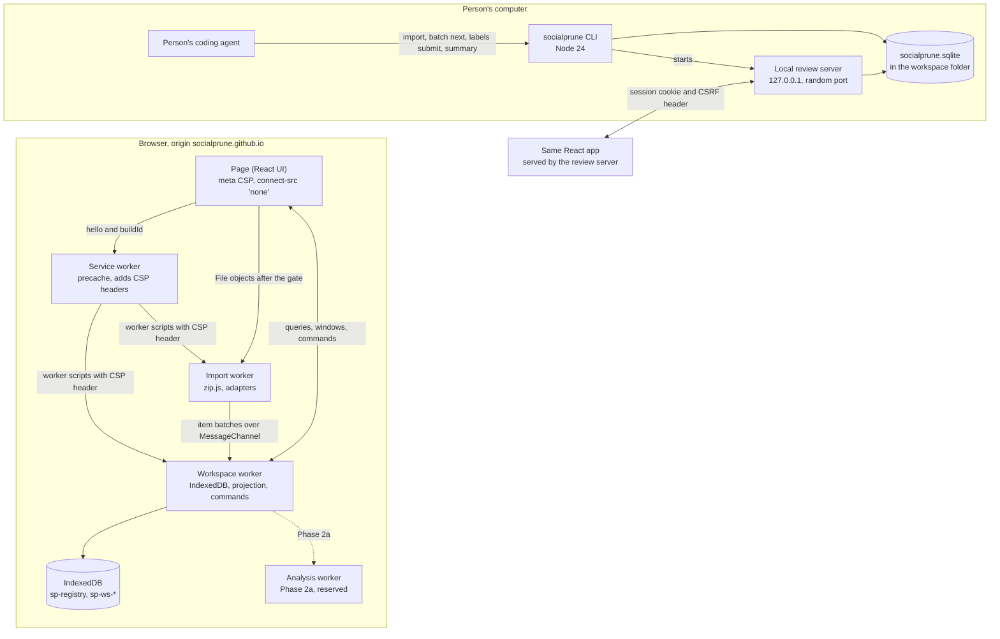
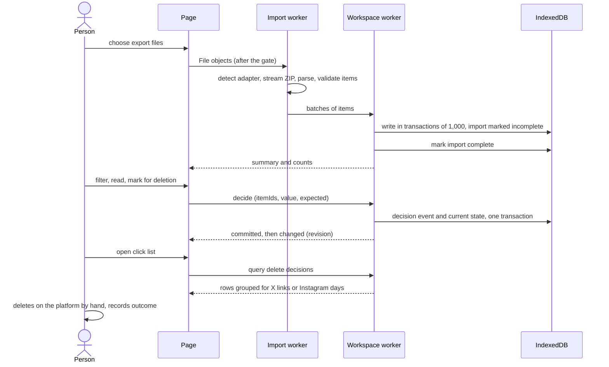

# SocialPrune architecture

This is the map for contributors. It describes how SocialPrune is meant to be built from Phase 2 on: which package owns what, which process runs where, how export data moves, and where the trust boundaries are. The reasons behind each choice are in the [decision records](adrs/README.md), and the measurements behind them in [evidence-2026-10.md](evidence-2026-10.md). The visual and interaction design is in [docs/design/README.md](../design/README.md).

Every record this map relies on is still `Proposed`. Nothing here is built yet, and several records leave a choice to the maintainer; the [index](adrs/README.md) lists them. Where a record names a conservative option to use until he decides, this map describes that option.

## What the system does

A person requests their data export from X or Instagram, opens it in SocialPrune, reviews old posts and comments with optional suggestions, marks what should go, and then deletes those items on the platform by hand, with a click list that SocialPrune prepares. SocialPrune itself never contacts the platforms.

There are two ways in:

- **Web app** on GitHub Pages. Everything runs in the browser; the export never leaves the device.
- **CLI** (`npx socialprune`) for people who work in a terminal or with a coding agent. The agent imports, labels items in batches and then hands over to the person, who reviews in the same web app served locally by `socialprune review`.

Phase 2 builds the web review, the demo, the CLI workspace commands and the agent interface. Suggestions from rules or a local model (`packages/classify`, `scan`) come in Phase 2a, after the classifier tiers are measured on hand-labelled data. Everything below works with no suggestions, with suggestions an agent submits, and later with rules or model suggestions, without a schema change.

## Hard constraints as design forces

`AGENTS.md` lists six hard constraints. Each one shapes a part of the design:

| Constraint | Where it shows up |
|---|---|
| 1. Nothing costs money | Static hosting on GitHub Pages ([ADR-019](adrs/ADR-019-pages-deployment.md)); storage in the browser or a local file ([ADR-005](adrs/ADR-005-browser-storage.md), [ADR-015](adrs/ADR-015-cli-storage-node-baseline.md)); free npm trusted publishing ([ADR-018](adrs/ADR-018-cli-distribution.md)) |
| 2. Local first | `connect-src 'none'` in the page and in every worker that touches export data, and a gate that keeps real data out of workers until that policy is in force ([ADR-004](adrs/ADR-004-content-security-policy.md)); item text reaches an agent only through `batch next --share-with-agent`, which prints what it shares on every call. The flag records the person's consent; it cannot enforce it ([ADR-014](adrs/ADR-014-agent-interface.md)) |
| 3. A person decides | Decisions are human events in an append-only log ([ADR-006](adrs/ADR-006-workspace-event-log.md)); only the review UI can write them, enforced by package structure ([ADR-017](adrs/ADR-017-shared-workspace-service.md)); the local review token stays off stdout, off every JSON document, log and error, and off stderr when stderr is not a terminal. It can still reach a pseudo-terminal or the browser's process arguments, which [ADR-016](adrs/ADR-016-local-review-server.md) lists as risks for the maintainer to decide on |
| 4. Nothing acts on the platform | No code requests X or Instagram, not even their images ([ADR-021](adrs/ADR-021-archive-media.md)) or help pages ([ADR-022](adrs/ADR-022-export-guide-content.md)); the click list is instructions for a person |
| 5. No promises | Copy rules and the forbidden-word check in the catalogs ([ADR-011](adrs/ADR-011-internationalization.md), [design specification](../design/README.md#content-rules)); demo suggestions say what they are ([ADR-020](adrs/ADR-020-demo-suggestions.md)) |
| 6. No real data in the repository | Demo and tests use generated exports from `fixtures/synthetic/`; the data guard blocks export signatures |

## Packages

| Path | Responsibility |
|---|---|
| `packages/core` | Data model and JSON schemas (v1 kept for migration, v2 current); archive reading and the import pipeline; the `PlatformAdapter` contract; the workspace service: storage port, event rules, re-import merge, backup writer and reader, query projection, review and label services; day grouping; export guide data. Runs in browsers and in Node; Node-only code lives under `src/node/`. |
| `packages/adapter-x`, `packages/adapter-instagram` | Detect an export, parse it into items, describe the click-list steps. A new platform is a new package of this kind. |
| `apps/web` | The React app: start page, export guide, demo, import, review, click lists, backup, settings. The service worker and its build plugin. The workspace worker with its IndexedDB store. The HTTP adapter used when the CLI serves the app. |
| `apps/cli` | The `socialprune` command: Stricli command tree and output contract, the SQLite workspace store, the local review server, the release build. |
| `skills/socialprune` | The Agent Skill people copy into their own agent. |
| `fixtures/synthetic` | Generated exports, the demo exports and their example suggestions. |
| `tools/` | Fixture generator and data guard. |
| `packages/classify` | Phase 2a: rules, local model backend, user-configured endpoints. Not in Phase 2. |
| `packages/mcp` | 0.2: MCP server over the same handlers as the CLI. Not in Phase 2. |

[ADR-017](adrs/ADR-017-shared-workspace-service.md) has the folder layout inside `packages/core/src/workspace/` and the rule that keeps decision writing out of CLI and MCP code.

## Runtime topology

The service worker is what turns the static Pages site into a site with response headers. It claims the page on its first activation, so a first visit gets control without a reload ([ADR-003](adrs/ADR-003-offline-app-shell.md)). Until it controls the page, no worker receives a person's data; the demo and the guide work at once, and the demo's workers are terminated when the gate passes, so every real-data worker is a fresh instance served with its header policy ([ADR-004](adrs/ADR-004-content-security-policy.md)). The import worker uses zip.js's native entry, so no WebAssembly runs in the browser; deflate64 and encrypted archives get a named diagnostic and the CLI as the way on. Each tab runs its own workspace worker; workers announce new revisions to each other over `BroadcastChannel`.

The local review page is the same React build in local-review mode. It has no service worker and no IndexedDB store; its workspace adapter talks to the review server with the same request and reply schemas the browser worker uses, defined once in `packages/core/src/workspace/protocol.ts` ([ADR-016](adrs/ADR-016-local-review-server.md)). It has only the review, click-list, settings and privacy routes; import, backup and restore are CLI commands there ([ADR-009](adrs/ADR-009-navigation.md)).

## Data flow

1. **Import.** The adapter registry detects the platform. zip.js streams the archive with the limits in `packages/core/src/archive/limits.ts`. Items are validated with zod and sent in batches straight to the workspace worker. Item IDs carry the platform prefix and are unique per workspace. Re-importing the same export adds nothing; a newer export updates engagement but never touches decisions ([ADR-006](adrs/ADR-006-workspace-event-log.md)).
2. **Store.** The workspace worker writes items, import records, assessments and events to IndexedDB, and keeps an in-memory projection of every item for queries ([ADR-005](adrs/ADR-005-browser-storage.md), [ADR-007](adrs/ADR-007-review-data-worker.md)).
3. **Review.** The page asks for counts and windows of at most 200 rows. Every change is a command with an idempotency ID and the values the person saw; the worker appends events and acknowledges. Undo appends the opposite events. Bulk changes go through a frozen preview.
4. **Export.** The click list for X has one status link per item with the action (delete or undo repost); for Instagram, items are grouped by day in a time zone the person can see and change; the CLI takes `--time-zone`, then the workspace setting, then the system zone ([ADR-012](adrs/ADR-012-time-zone-grouping.md)). The person records outcomes ("Deleted by you") separately from decisions ("Marked for deletion").
5. **Backup.** The workspace streams out as one JSON document, v2, which the browser and the CLI both read and write.

The CLI flow is the same with SQLite in place of IndexedDB, Stricli commands in place of the page, and the review server in place of the workspace worker.

## Trust boundaries and policy layers

| Boundary | What crosses it | Control |
|---|---|---|
| Export file into the app | untrusted bytes | parsed as data, never executed; zip limits; zod validation; the X `injection` fixture tests this |
| Item text into the UI | untrusted strings | React text nodes only; `dangerouslySetInnerHTML` forbidden by lint; Trusted Types with one script-URL policy and no HTML policy |
| Page and workers to the network | nothing | `connect-src 'none'` in meta and in service-worker headers; the gate; the Playwright network audit on every import path |
| Being framed by another site | nothing | top-level check before mounting data screens; `frame-ancestors 'none'` on controlled loads |
| Item text into an agent | item text, by consent | `--share-with-agent`; content marked `trust: "untrusted"`; the agent can submit labels only |
| Agent into decisions | nothing through SocialPrune's commands | no command or tool writes decisions; `ReviewService` cannot be imported by CLI command code; token kept out of piped output, with the pseudo-terminal and process-argument exposures named in ADR-016 |
| Other web pages into the local review server | nothing | exact Host and Origin checks, no CORS, one-use fragment token, HttpOnly session cookie, CSRF header |
| Software running as the same user | not defended | stated as a limit; the click list shows each decision's source so an unexpected one is visible |

The policy in each context is listed in [ADR-004](adrs/ADR-004-content-security-policy.md) for the browser and in [ADR-016](adrs/ADR-016-local-review-server.md) for the local review. `pnpm dev` uses a development policy with inline styles and a dev-server connection; tests always run against the built app.

## Storage

| | Browser | CLI |
|---|---|---|
| Store | IndexedDB through idb 8.0.4, one database per workspace | `node:sqlite`, one `socialprune.sqlite` per workspace folder; workspace commands check the Node version at start ([ADR-015](adrs/ADR-015-cli-storage-node-baseline.md)) |
| Append-only records | assessments, submissions, decision and outcome events, each keyed by append order with a unique ID index | the same, as `STRICT` tables with triggers against `UPDATE` and `DELETE` |
| Writes | items in transactions of 1,000; each human command in one strict-durability transaction | `BEGIN IMMEDIATE`, chunks of 1,000, rollback journal, 5 s busy timeout |
| Queries | in-memory projection in the workspace worker | the same projection code in the review server's database worker |
| Persistence | `navigator.storage.persist()` after the first import, on a click; browsers may still clear storage | the file stays until the person deletes it |
| Portable form | v2 workspace document, streamed out and in | the same document |

Both stores implement one `WorkspaceStore` port from `packages/core`, so the rules for events, re-import and backup exist once. A backup from the browser restores in the CLI and the other way round. A restore replaces the current workspace only after the whole file validated. The backup carries the label submission records, so a label file that was already submitted stays a no-op after a restore, and `lastBackupAt` records when the last complete backup was written.

## Agent interface

Agents use the CLI with `--json`: one JSON document per call on stdout, progress on stderr, stable exit codes 0 to 4 and symbolic error codes ([ADR-013](adrs/ADR-013-cli-framework-output.md)). The loop is `import`, then `batch next --share-with-agent` and `labels submit` until no items remain, then `summary`, then `review` for the person ([ADR-014](adrs/ADR-014-agent-interface.md)). The skill in `skills/socialprune/` walks an agent through it, requires it to tell the person before the first batch that the full text of their entries goes to the agent's model provider, and lists what it must not do, including `review --no-open`. Agent suggestions appear in the review with the source badge "Agent". MCP in 0.2 will expose the same handlers over stdio, with the same missing capability: no tool decides.

## Adding a platform

1. Create `packages/adapter-<platform>` implementing `PlatformAdapter` from `packages/core/src/adapter/`: `detect` with a confidence and a variant name, `parse` producing `Item`s whose IDs start with `<platform>:`, the `export` description, and `clickList` steps. Set `mediaCount` when the export says how many media files an item has.
2. Add generated fixtures for every known export variant under `fixtures/synthetic/<platform>/`, each with an `expected.json` written from the fixture data, and an `injection` variant.
3. Register the adapter in the web app's adapter list and in the CLI's.
4. Add the platform's guide facts to `packages/core/src/guide/` with sources and verification dates ([ADR-022](adrs/ADR-022-export-guide-content.md)), and its strings to both catalogs.
5. Run the full suite, including the browser network audit, which picks up new fixtures automatically.

No change to `packages/core` should be needed. If one is, that is a gap in the adapter contract and needs its own decision record.

## Decision records

All proposed; see the [index](adrs/README.md) for status and open maintainer decisions.

| ADR | Proposed decision |
|---|---|
| [001](adrs/ADR-001-decision-records.md) | One file per decision; change only by supersession |
| [002](adrs/ADR-002-dependency-licenses.md) | MIT, ISC, BSD-2/3-Clause, 0BSD, Apache-2.0; exceptions need their own record; checked in CI |
| [003](adrs/ADR-003-offline-app-shell.md) | App-owned service worker with a generated manifest; prompted updates |
| [004](adrs/ADR-004-content-security-policy.md) | Policy per context; real-data workers wait for service-worker control; Trusted Types; serve-only dev policy |
| [005](adrs/ADR-005-browser-storage.md) | idb 8.0.4 with unwrapped bulk writes; persistence on request |
| [006](adrs/ADR-006-workspace-event-log.md) | Append-only decision and outcome events; schema v2; v1 migration; portable backup |
| [007](adrs/ADR-007-review-data-worker.md) | Workspace worker owns data; windowed protocol; literal substring search |
| [008](adrs/ADR-008-review-ui-primitives.md) | Base UI, TanStack Virtual and an app-owned grid; scoped single-key shortcuts; IBM engine checks |
| [009](adrs/ADR-009-navigation.md) | Hash routes, app-owned router |
| [010](adrs/ADR-010-styling-tokens.md) | CSS Modules with `@layer` and tokens |
| [011](adrs/ADR-011-internationalization.md) | React Intl with bundled, checked ICU catalogs |
| [012](adrs/ADR-012-time-zone-grouping.md) | Day keys from `Intl.DateTimeFormat` in a visible IANA zone |
| [013](adrs/ADR-013-cli-framework-output.md) | Stricli with an exit adapter; one JSON document per call |
| [014](adrs/ADR-014-agent-interface.md) | Stateless batches, idempotent label files, consent flag, skill in `skills/` |
| [015](adrs/ADR-015-cli-storage-node-baseline.md) | `node:sqlite`, rollback journal, Node 24.15.0 minimum for workspace commands |
| [016](adrs/ADR-016-local-review-server.md) | Loopback server, one-use fragment token handed to the browser, never on stdout or piped stderr |
| [017](adrs/ADR-017-shared-workspace-service.md) | Workspace rules in `packages/core` behind a storage port; decision writing isolated |
| [018](adrs/ADR-018-cli-distribution.md) | Rolldown bundle; package contents; inert release workflow |
| [019](adrs/ADR-019-pages-deployment.md) | Manual Pages workflow, publish off by default |
| [020](adrs/ADR-020-demo-suggestions.md) | Hand-written example suggestions with source kind `fixture`, demo only |
| [021](adrs/ADR-021-archive-media.md) | Media count shown, media not displayed |
| [022](adrs/ADR-022-export-guide-content.md) | Guide facts with sources and dates, re-read by a person before each release |
